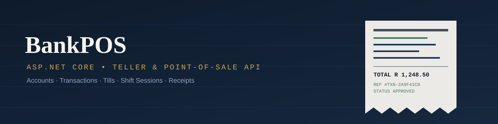
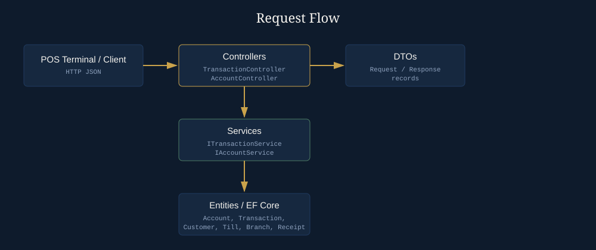

<div align="center">



# BankPOS

**A teller-facing Bank Point-of-Sale (POS) REST API built with ASP.NET Core, C#, and Entity Framework Core.**

Manages customer accounts, tellers, tills, shift sessions, transactions, and receipts for retail banking branches.

[](https://dotnet.microsoft.com/)
[](https://learn.microsoft.com/aspnet/core)
[](https://learn.microsoft.com/dotnet/csharp/)
[](#license)
[](#contributing)

</div>

---

## About

BankPOS is a learning-friendly reference implementation of a **bank branch point-of-sale system** — the kind of backend that sits behind a teller's counter, not a customer's mobile app. It models the everyday mechanics of in-branch banking: opening a till at the start of a shift, creating and servicing customer accounts, posting deposits/withdrawals as transactions, and printing a receipt at the end.

It's built as a straightforward **ASP.NET Core Web API** using **Controllers + DTOs + Services + EF Core entities**, which makes it a good example project for anyone learning:

- ASP.NET Core Web API fundamentals (routing, controllers, model binding)
- Clean separation between **DTOs** (`BankPOS.DTOs`) and **domain entities** (`BankPOS.Entities`)
- Service-layer patterns via interfaces (`ITransactionService`, `IAccountService`)
- Modeling real-world domain relationships (Branch → Till → ShiftSession → Transaction → Receipt)

## Architecture



Requests flow from the client through thin controllers, into service interfaces that hold the business logic, and down to EF Core-backed entities. DTOs (records) keep the wire format decoupled from the domain model.

## Domain model

| Entity         | Purpose                                                            |
| -------------- | ------------------------------------------------------------------ |
| `Customer`     | The person a bank account belongs to                               |
| `Account`      | A customer's bank account (type, number, balance)                  |
| `Transaction`  | A deposit, withdrawal, or transfer posted against an account       |
| `Receipt`      | A printable record tied to a completed transaction                 |
| `Branch`       | A physical bank branch                                             |
| `Till`         | A physical POS terminal/till located at a branch                   |
| `ShiftSession` | A teller's open/close session on a till, with opening/closing cash |

## Features

- ✅ Create and list customer accounts
- ✅ Create transactions and fetch transaction history (all, or by account)
- ✅ Domain modeling for branches, tills, and teller shift sessions
- ✅ Receipt entity linked 1:1 with a transaction
- ✅ Clean DTO layer using C# records with data annotations
- 🚧 Authentication/authorization (not yet implemented — see [Contributing](#contributing))
- 🚧 Shift session & till API endpoints (entities exist, controllers pending)
- 🚧 Automated tests

## Tech stack

- **Language:** C#
- **Framework:** ASP.NET Core Web API
- **Data access:** Entity Framework Core
- **API style:** REST, JSON, DTO records with `System.ComponentModel.DataAnnotations`

## Getting started

### Prerequisites

- [.NET SDK 8.0+](https://dotnet.microsoft.com/download)
- SQL Server (or update `appsettings.json` to point at your preferred provider)

### Run locally

```bash
git clone https://github.com/<your-org>/BankPOS.git
cd BankPOS
dotnet restore
dotnet ef database update   # applies migrations, if present
dotnet run --project src/BankPOS.Api
```

The API will be available at `https://localhost:5001` (check your `launchSettings.json` for the exact port). Swagger/OpenAPI is available at `/swagger` in development.

## API reference

| Method | Route                             | Description                           |
| ------ | --------------------------------- | ------------------------------------- |
| `GET`  | `/api/GetTransactions`            | List all transactions                 |
| `POST` | `/api/GetTransactionsByAccountId` | List transactions for a given account |
| `POST` | `/api/CreateTransaction`          | Post a new transaction                |
| `POST` | `/api/createAccount`              | Create a new customer account         |

> **Note for contributors:** route casing and verbs are inconsistent right now (`GetTransactions` vs `createAccount`, `GET`-like actions exposed as `POST`). Standardizing these to conventional REST casing/verbs is a great first issue — see below.

## Contributing

Contributions are very welcome, especially from folks learning ASP.NET Core. Good first issues:

1. Standardize route naming/casing across controllers (see note above)
2. Add `AccountController` endpoints for fetching a customer's accounts (`GetCustomerAccountsResponse` DTO already exists, unused)
3. Wire up `ShiftSession` and `Till` controllers/services
4. Add input validation and proper error responses (400/404) instead of always returning `Ok`
5. Add unit/integration tests for the service layer

To contribute:

```bash
git checkout -b feature/short-description
# make your changes
git commit -m "Describe your change"
git push origin feature/short-description
```

Then open a pull request describing what changed and why. Please keep PRs focused and small where possible — it makes review faster for everyone.

## License

Licensed under the [MIT License](LICENSE).

---

<div align="center">
<sub>Built as a reference project for ASP.NET Core Web API, C#, and clean domain modeling in banking/fintech systems.</sub>
</div>
